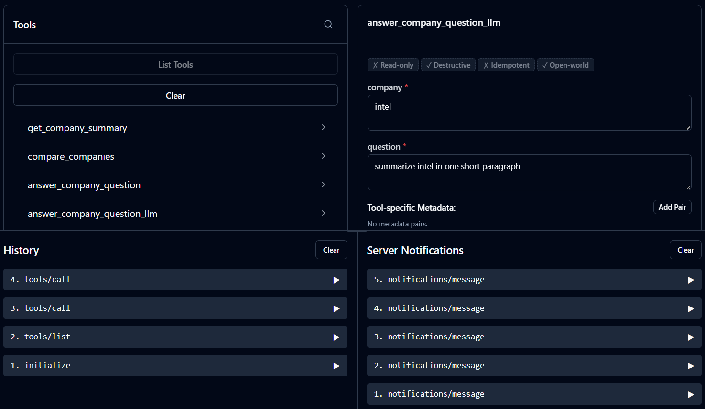
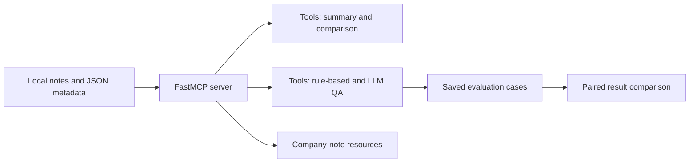

# ChipScope MCP

**A small MCP server for comparing semiconductor companies with explicit tools and testable answers.** An AI client can ask ChipScope to retrieve a local company note, compare structured company facts, or answer a question using either fixed rules or an LLM. The project explores a practical agent-engineering question: *how do you make a model's access to domain context inspectable and measurable?*

[](https://github.com/QinnniQ/chipscope-mcp/actions/workflows/tests.yml) 

## What it demonstrates

| Part | What it does | Engineering decision |
| --- | --- | --- |
| MCP tools | Expose summaries, side-by-side metadata, rule-based QA, and LLM QA to an MCP client | Give an agent named, inspectable actions instead of one opaque chat prompt. |
| MCP resources | Expose local company notes as `semiconductor://` resources | Keep source context separate from tool calls. |
| Rule-based baseline | Answer known question types directly from metadata | Provide predictable behavior to compare with generative answers. |
| LLM answer path | Send the selected local note and metadata to OpenAI Responses | Allow more flexible wording while constraining the available context. |
| Evaluation | Run saved cases and compare baseline and LLM results by company and question | Reveal differences and regressions on a fixed set of examples. |

The current dataset contains **three manually prepared company profiles: ASML, TSMC, and Intel**. There is no live data ingestion, document retrieval, source citation, or deployed customer service. Treat the notes as illustrative context that can become outdated, not as verified investment or semiconductor research.



## Architecture



`src/server/mcp_server.py` reads one company slug at a time from local files. The LLM path uses the same local context to build its prompt; an API key is needed only for that path. Invalid names are rejected before any file read. The tools and resources can be inspected with an MCP client such as [MCP Inspector](https://github.com/modelcontextprotocol/inspector).

## What the saved results show

| Saved run | Result | Scope |
| --- | ---: | --- |
| Rule-based QA | 5/5 | Exact or required-text checks on five hand-written cases. |
| LLM QA | 5/5 | Case-insensitive required-text checks on five hand-written cases. |

These [committed results](src/evals/results/) are a **small smoke-test snapshot**. They do not measure factual accuracy beyond the local notes, citation quality, hallucination rate, statistical reliability, or performance on unseen questions. The LLM run requires an API key and can vary across reruns; CI verifies the deterministic paths without making paid API calls. The comparison script now pairs answers to the *same company and question*, even though the two result files use different case IDs.

## Run it locally

Requires Python 3.10+. From the repository root:

```bash
python -m venv .venv
# Activate .venv for your shell, then:
python -m pip install -r requirements.txt
python src/evals/run_company_qa_eval.py
```

To run the LLM evaluation, copy `.env.example` to `.env`, set `OPENAI_API_KEY`, and run:

```bash
python src/evals/run_company_qa_eval_llm.py
python src/evals/compare_eval_runs.py
```

The scripts overwrite the JSON files in `src/evals/results/`, so retain a copy before comparing runs you want to keep. The LLM evaluation makes paid API calls.

To inspect the MCP tools, start [MCP Inspector](https://github.com/modelcontextprotocol/inspector) and configure it to run your environment's Python executable with `src/server/mcp_server.py` as its argument. The server uses standard input/output transport when run as a script.

## Tests and project limits

```bash
python -m pip install -r requirements-dev.txt
python -m pytest --cov=src.server.mcp_server --cov=src.evals.compare_eval_runs --cov-report=term-missing --cov-fail-under=75
```

GitHub Actions runs that deterministic suite on pushes and pull requests with Python 3.10 and 3.12. The test suite covers tool outputs, company-name validation, a mocked LLM call, the fixed baseline cases, and evaluation pairing. It does **not** claim live-API, factual-research, or production-deployment coverage.

## Next engineering steps

Replace the hand-written notes with dated, citable source documents; add retrieval that returns the supporting passage; and expand evaluation to unsupported and adversarial questions before using the answers for decisions.

**Author:** Nicholai Gay · AI engineering, agent tools, and evaluation.
